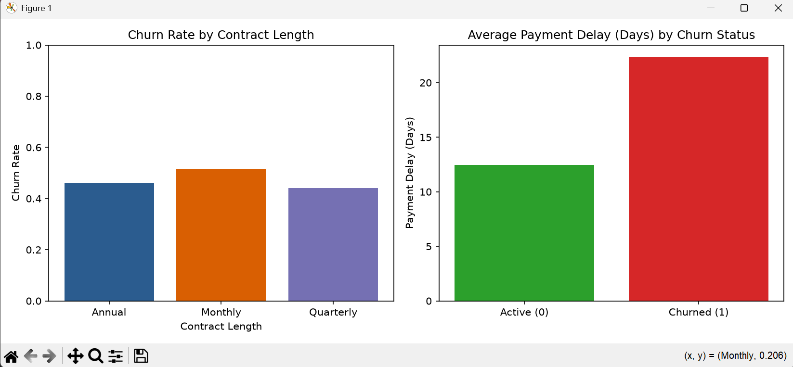

# Customer Churn Prediction

An end-to-end Machine Learning pipeline predicting customer churn probability built for the AI/ML Practical Assessment.

## Repository Contents
- `customer_churn.csv`: Provided dataset
- `main.py`: Preprocessing, analysis, model training, and prediction function
- `requirements.txt`: Python dependencies

## Setup & Execution Instructions
1. **Clone the repository:**
  git clone [https://github.com/Felanso-777/Customer-Churn-Prediction-.git](https://github.com/Felanso-777/Customer-Churn-Prediction-.git)
cd Customer-Churn-Prediction-
2. Set up virtual environment
python -m venv .venv
.venv\Scripts\activate   # On Windows
#source .venv/bin/activate  # On macOS/
3. Install required dependencies:
pip install -r requirements.txt
4. Execute the project script:
python main.py
# Customer Churn Prediction

An end-to-end Machine Learning pipeline predicting customer churn probability built for the AI/ML Practical Assessment.

---

## Exploratory Data Analysis & Visualizations


### Key Observations
1. **Contract Length vs. Churn**: Customers on **Monthly** contracts exhibit the highest churn rate (~51.6%), whereas **Quarterly** (~44.0%) and **Annual** (~46.2%) contract holders are more stable.
2. **Payment Delay vs. Churn**: Customers who churn have significantly higher average payment delays (~22.3 days) compared to active customers (~12.5 days).

---

##  Model Evaluation & Comparison

| Model | Accuracy | Precision | Recall | F1 Score |
| :--- | :---: | :---: | :---: | :---: |
| **Logistic Regression** | 82.57% | 81.23% | 82.19% | 0.8171 |
| **Random Forest** | **99.86%** | **99.90%** | **99.80%** | **0.9985** |

* **Selected Model**: **Random Forest** due to superior performance across all metrics.

---

##  Sample Prediction Output

```text
Sample Prediction: Likely to Churn | Churn Probability: 96.83%